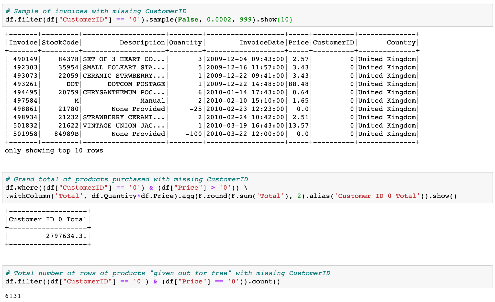
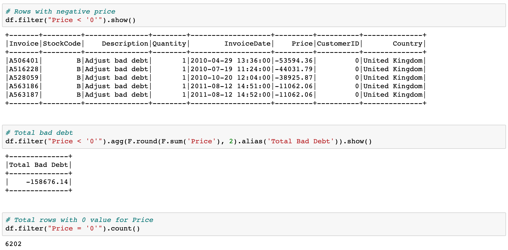
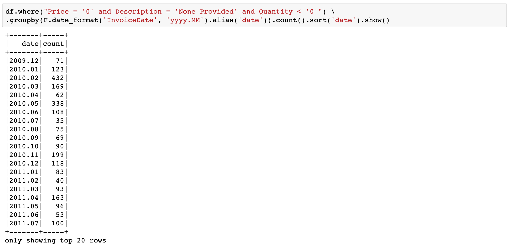
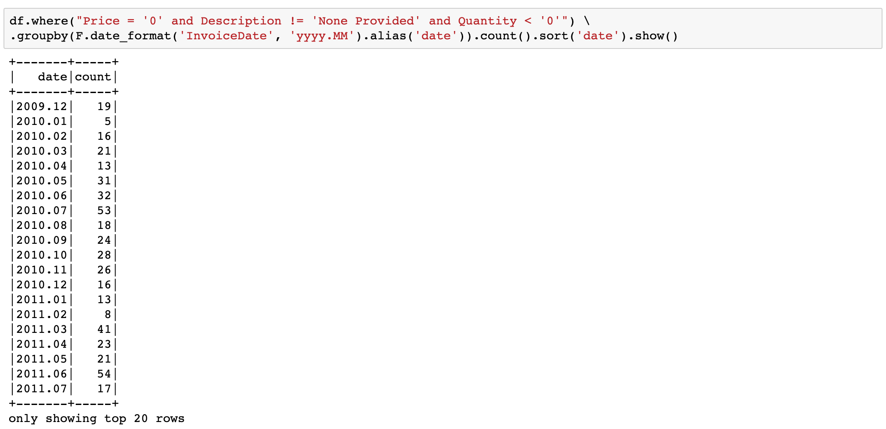
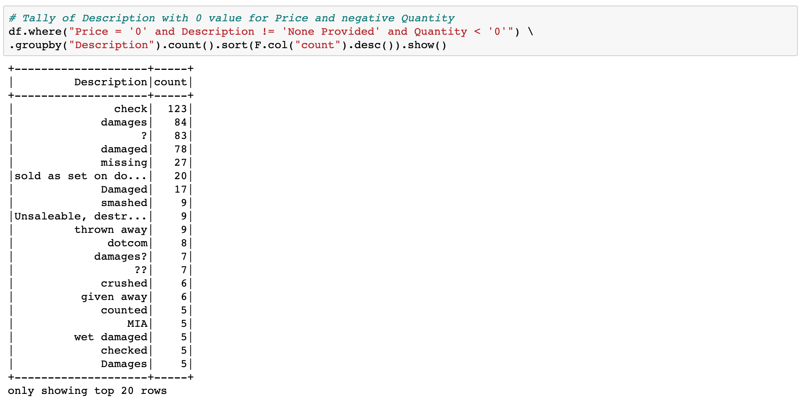
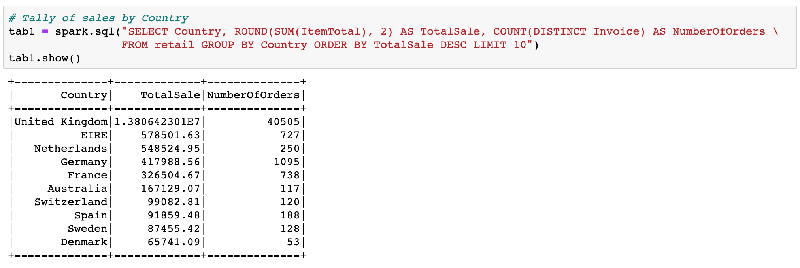
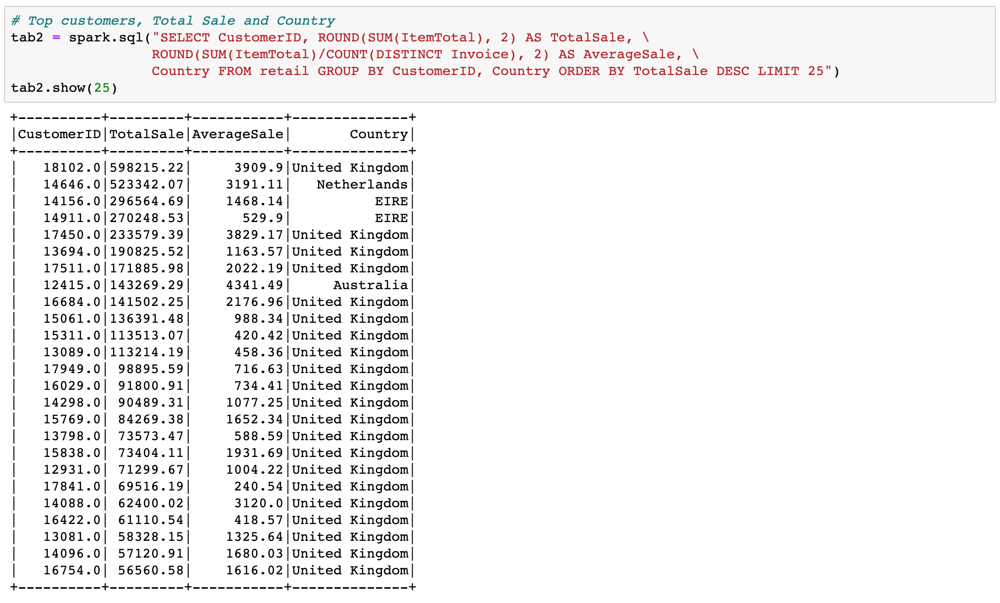

# Online_Retail_w_PySpark
Using PySpark to perform EDA and Customer Segmentation.

## Overview of Data
The data comes from UCI machine learning database and it consists of 1,067,371 entries and 8 columns, Invoice, Stock Code, Description, Quantity, Invoice Date, Price, Customer ID and Country in excel format.
There are some missing values in mainly in Customer ID and Description.

## Procedure
The file is read into Pandas and subsequently converted into Spark Dataframe. The missing Customer ID is replaced by '0' and missing Description is replaced by 'None Provided'. In the first queries, we take a closer look at missing Customer ID '0'.

There is about 2.8 million worth of products purchased by Customers whose ID are not captured. There are also 6131 entries where products were "given away" (Price == 0) to Customers with missing ID. This could become an accounting issue as these transactions could be suspicious.

Looking at entries with less than zero Price, there are 5 entries, all of which were "Bad Debt" being written off. Curiously, the last 2 entries were for the exact amount and they were entered 1 minute apart.

There are considerable more entries logged with no product Description with zero Price than with product Description with zero Price.

Being that the business is located in the United Kingdom, the top 25 Customers are mostly from the United Kingdom and the other Countries that bought the most are also in Europe.
